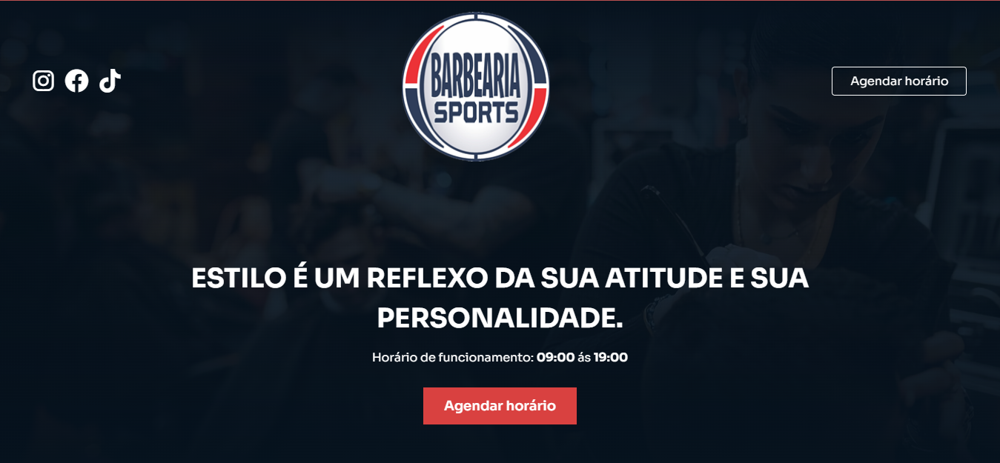

    

  Página de uma barbearia 

 
<h1>Sobre o Projeto</h1>

Pagina sobre barbearia desenvolvido junto a aula do Sujeito Programador. 

 

<h1>Funcionalidades</h1>

 

<h1>Tecnologias</h1>

Projeto desenvolvido com as seguintes Tecnologias

<ul>
    <li>JavaScript</li>
    <li>Html</li>
    <li>Css</li>  
    <li>Sass</li>    
</ul>

 

<h1>Projeto finalizado</h1>

<a href="https://kelson-carvalho.github.io/Barbearia-Sport/" target="_blank">Clique aqui para seguir para o projeto finalizado</a>

<h1>Licença</h1>

Esse projeto está sob a licença MIT.

 

Feito com ❤️ por Kelson Carvalho

